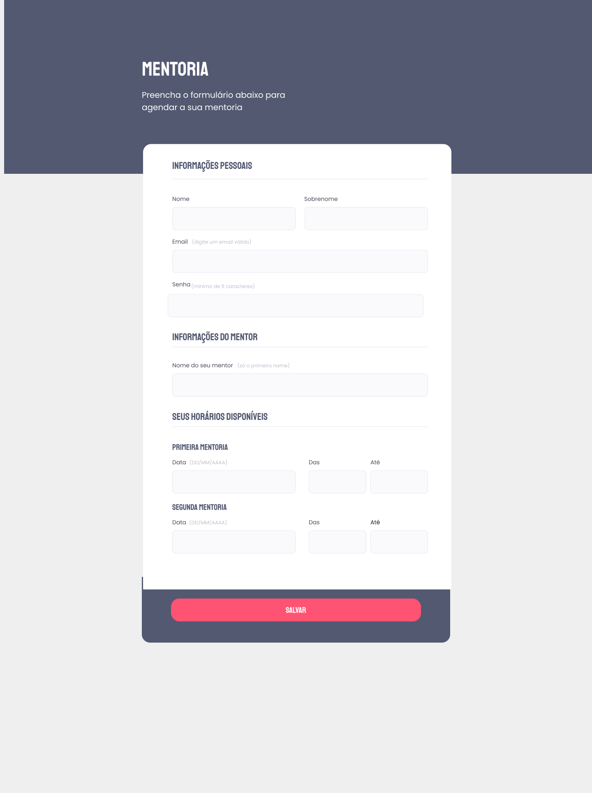

<h1 align="center">Formulário</h1>

 Projeto desenvolvido através do curso Explorer da Rocketseat, plataforma de ensino de tecnologia Web .    

  <a href="#-tecnologias">Tecnologias</a>&nbsp;&nbsp;&nbsp;|&nbsp;&nbsp;&nbsp;
  <a href="#-projeto">Projeto</a>&nbsp;&nbsp;&nbsp;|&nbsp;&nbsp;&nbsp;
  <a href="#-layout">Layout</a>&nbsp;&nbsp;&nbsp;|&nbsp;&nbsp;&nbsp;
  <a href="#memo-licença">Licença</a>

  

 

  

## 🚀 Tecnologias

Esse projeto foi desenvolvido com as seguintes tecnologias:

- HTML
- CSS
- Figma

## 💻 Projeto

Formulario de agendamento de mentoria . -[Visite o projeto online](#)

## 🔖 Layout

Você pode visualizar o layout do projeto através [DESSE LINK]https://www.figma.com/file/CArvy1i3lmnHyLL2uZf7Cr/Stage-03---Formul%C3%A1rio-intermedi%C3%A1rio-(Copy)?node-id=3%3A4&t=ZLML7QR8fsUcKA1R-0. É necessário ter conta no [Figma](https://figma.com) para acessá-lo.

## :memo: Licença

Esse projeto está sob a licença MIT.
